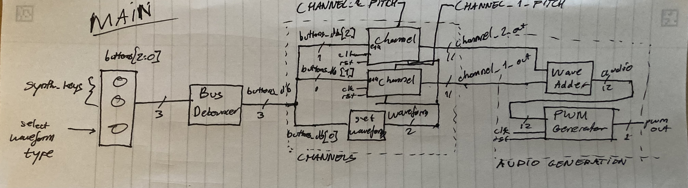

# Digital Synthesizer - MVP

Devlin Ih and Neel Dhulipala

## Overview

The goal of this project was to make a dual-channel digital synthesizer. The
input consists of three buttons, with one that selects a waveform for both
channels and the other two being keys with fixed pitches. The output of our
module is a PWM signal that is read by a [Digilent
PmodAMP2](https://digilent.com/reference/pmod/pmodamp2/start) as an audio
signal, which can be outputted by a speaker. [@fig:main] displays the block
diagram of our circuit.

{#fig:main}

In this report, we will describe each aspect of the module.

## Audio PWM Generator

The `audio_pwm_generator` module takes in our 12 bit audio signal and modulates
it out as a 1-bit PWM signal. Its input ports are are `[11:0] audio`, `clk`,
`rst`, and `ena`. Its output port is `pwm_out`. [@fig:ag] is a schematic of the
module.

`audio_pwm_generator` modulates the output by making a greater than comparison
to a 12-bit counter.

{#fig:ag}

We improved the quality of the PWM signal with a simple trick found in this
[blog post](https://zipcpu.com/dsp/2017/09/04/pwm-reinvention.html): reversing
the bits in the counter to generate the PWM signal. This improves the spacing
of the pulses. This is best illustrated with an example. Luckily, [@tbl:pwm]
has an example of a 3 bit sample PWM module with a sample of `3'b100`.

| `counter` | `out` | `counter_rev` | `out_rev` |
|-----------|-------|---------------|-----------|
| `000`     | `1`   | `000`         | `1`       |
| `001`     | `1`   | `100`         | `0`       |
| `010`     | `1`   | `010`         | `1`       |
| `011`     | `0`   | `110`         | `0`       |
| `100`     | `0`   | `001`         | `1`       |
| `101`     | `0`   | `101`         | `0`       |
| `110`     | `0`   | `011`         | `0`       |
| `111`     | `0`   | `111`         | `0`       |

: PWM generator with a sample of `3'b100`. Both the counter and
  reversed counter have the same number of high output cycles, but the reversed
  counter has more distribution among the pulses. {#tbl:pwm}

The PWM module takes a 12-bit sample from the `audio` port every 272 clock
cycles. With a clock frequency of 12MHz, this yields a sample rate of
$12000000/272 \approx 44.1\text{kHz}$, twice the highest pitch a human can hear.

You might be wondering how we can modulate a 12-bit sample in 272 clock cycles.
The answer is, we can't. However, due the reversed counter, the output becomes
a $\log_2(272) \approx 8.09$ bit approximation of the 12-bit sample.

## Channel

The `channel` module is responsible for generating waveforms and adding effects
to them. Its inputs are `clk`, `ena`, `rst`, `[11:0] pitch`, and `[1:0]
waveform`. Its output is `[10:0] out`. [@fig:chl] is a schematic 
of the module.

{#fig:chl}

`channel` is able to select between 4 different waveforms, shown in
[@tbl:waveforms]. It can generate frequencies in the from 5.7Hz to 23437.5Hz.
the frequency generated is controlled from the `[11:0] pitch` input (0--4095)
and is modeled by [@eq:frequency].

| `[1:0] waveform` | Waveform |
|------------------|----------|
| `00`             | Square   |
| `01`             | Triangle |
| `10`             | Sine     |
| `11`             | Sawtooth |

: Waveform generated by channel based on `waveform` select input.
  {#tbl:waveforms}

$$ f(x) = \frac{12MHz}{2 \cdot 256 \cdot (x+1)} $$ {#eq:frequency}

The `channel` module contains an 8-bit counter. The counter increments at a
rate defined by the [`clock_divider`]({#sec:clock_divider}) module and `pitch`.
Its value represents the sample number of an 8-bit sample, which is fed into
one of 4 [waveform generator]({#sec:wave_generators}).

### Clock Divider {#sec:clock_divider}

The `clock_divider` module exists to slow the clock signal by a specified
amount for generating audio waveforms. Its inputs are `clk`, `rst`, and `7:0
divide` and its output is `clk_divided`.

`clock_divider` outputs a clock at a frequency defined by:

$$ \text{output freq} = \frac{\text{input freq}}{2 (divide+1)} $$

### Wave Generators {#sec:wave_generators}

Each wave generator is a combinational logic block that takes an 8-bit input
(from a `channel`s period counter) and outputs an 11-bit value representing a
waveform's sample.

`sq_wave_generator` outputs a square wave with the following CL:

```systemverilog
always_comb square = (period[7]) ? -1 : 11'b0;
```

Alternatively, you could extend the most significant bit of the input instead
of muxing it.

`tri_wave_generator` outputs a triangle wave with the following CL:

```systemverilog
always_comb begin
   triangle = period[7] ? {~period[6:0], ~{4{period[0]}}}
                        : { period[6:0],  {4{period[0]}}};
end
```

`sine_wave_generator` outputs a sine wave from a lookup table defined as giant
`case` statement.

`saw_wave_generator` outputs a sawtooth wave with the following CL:

```systemverilog
always_comb saw = {period, {3{period[0]}}};
```

## Debouncing

Since our synthesizer has keys with buttons, these buttons need to be debounced 
so that the signal inputted into the channel module is reliable.
To do this, we created our own "bus debouncer," which debounces all the buttons 
virtually simultaneously. It has a parameter `N` representing the number of buttons 
in the bus.
Its inputs are `clk`, `rst`, and `bouncy_in[N-1:0]`, and 
its output is `debounced_out[N-1:0]`.

Before understanding how that works, first we implemented a 1-bit debouncer.
The debounces FSM has four main states: `S_0`, `S_1`, `S_MAYBE_0`, and
`S_MAYBE_1`. The two former states (`S_0` and `S_1`) are enabled when the
debouncer knows the button's state, and the latter two states (`S_MAYBE_0` and
`S_MAYBE_1`) are active when the debouncer is trying to figure out the state of
the button.

To switch between the states, we need a set number of `BOUNCE_TICKS` to process 
how long to wait (i.e. how many clock cycles) to confirm the state of our button. 
Say the FSM is at `S_0`. Once the button is pressed (goes HIGH), the state will 
change to `S_MAYBE_1`. To know if the button is actually staying pressed, we 
need to count up `BOUNCE_TICKS` number of clock cycles, and if the button state 
is still HIGH, we can then change to `S_1`. This means we need a counter (D flip 
flop) to count the number of clock cycles since changing states and a comparator 
to see when our counter is equal to `BOUNCE_TICKS`.

Using a `generate` block, we allowed for all the buttons in a bus to be debounced.

## Monostable

We implemented a monostable for the button controlling the waveform mode. The 
reason for this is that the waveform mode changes for every press; however, we 
did not want to have the states cycle through every clock cycle as the user 
holds down the button. To make sure that holding down the waveform mode button 
counts as one button press (i.e. a press over one clock cycle), we use a 
monostable.
Its inputs are `clk`, `rst`, and `button`, and its output is `out`.

Every clock cycle, the previous state of the button `prev` is updated to be 
the current state. (The exception is when the reset button is hit, in which 
case `prev` is set to 0). Once the button is released, the button will fall 
LOW while `prev` stays HIGH for one clock cycle. The following logic:

```systemverilog
always_comb out = button & ~prev
```

ensures that the output goes high for that one clock cycle after release.

## Wave Adder

The `wave_adder` adds up two 11-bit signals to output a 12-bit signal. 
It is a fairly simple module: both 11-bit signals have a 0 appended 
at the front to extend them both into 12-bit signals, and they are 
added together behaviorally. Its inputs are `channel1[10:0]` and 
`channel2[10:0]`, and its output is `out[11:0]`.

## Get Waveform

Finally the `get_waveform` module is an FSM that outputs which waveform is 
currently selected. There are four states for each waveform: `S_SQUARE`, `S_TRIANGLE`, 
`S_SINE`, and `S_SAWTOOTH`. Whichever state is active determines the output of 
the module `waveform_out` as the 2-bit code of the waveform selected. 
(See [@tbl:waveforms].)

First, the incoming `waveform_button` signal is run through a monostable. This is to 
ensure that if the button is being held down, the module reads that as a singular 
button press (with the length of one clock cycle). Every clock cycle, the FSM checks 
to see if the button signal goes high (is pressed), and when it is, it cycles to the 
next state. When the module is reset, it defaults to `S_SQUARE` as its state.
